-----

## output: rmarkdown::github\_document

``` r
set.seed(18200537)

library(readr)
library(ggplot2)
library(readr)
library(dplyr)
library(magrittr)
library(shiny)
library(rstan)
library(shinystan)
library(ggiraph)
library(gganimate)
library(reshape2)


# Required for plotting bayesian sampling output
if (!require(bayesplot)) install.packages('bayesplot')
library(bayesplot)

# Required for plotting bayesian sampling output
if (!require(rstanarm)) install.packages('rstanarm')
library(rstanarm)

# Required for plotting animated time series
if (!require(gifski)) install.packages('gifski')
library(gifski)


# Required for plotting animated time series
if (!require(rsconnect)) install.packages('rsconnect')
library(rsconnect)
```

### Question 1 : Import the dataset exo\_data.csv as a tibble. Columns 1, 16, 17, 18, 25 should be characters. Columns 2, 14 should be factors. Column 15 should be integers. The remaining columns should be doubles.

``` r
#loading the csv data and columns in respective format type. Looks like only these four column type had to be changed all others are in respective type.
data <- read_csv(file = "/Users/prash/UCD/Sem3/R/Project/Exoplanet_Analysis_R_Project/_site/exo_data.csv", col_types = cols(
  year = col_integer(),
  flag = col_factor(),
  meth = col_factor(),
  age = col_double()
) )

glimpse(data)
```

    ## Observations: 3,659
    ## Variables: 25
    ## $ id        <chr> "KOI-1843.03", "Kepler-974 b", "KOI-1843.02", "Kepler-…
    ## $ flag      <fct> 0, 0, 0, 0, 0, 0, 0, 0, 0, 0, 0, 0, 0, 0, 0, 0, 0, 0, …
    ## $ mass      <dbl> 0.0014, NA, NA, 0.2500, 0.1700, 0.0220, 0.0321, NA, 0.…
    ## $ radius    <dbl> 0.05400, 0.14000, 0.07100, 0.84000, 0.82000, 0.14700, …
    ## $ period    <dbl> 0.1768913, 4.1944965, 6.3560060, 19.2241800, 39.031060…
    ## $ axis      <dbl> 0.00480, 0.03900, 0.05200, 0.14300, 0.22900, 0.02710, …
    ## $ ecc       <dbl> NA, NA, NA, 0.0626, 0.0684, NA, 0.0600, NA, NA, 0.1500…
    ## $ per       <dbl> NA, NA, NA, NA, NA, NA, 350.00, NA, NA, 277.59, NA, NA…
    ## $ lon       <dbl> NA, NA, NA, NA, NA, NA, NA, NA, NA, NA, NA, NA, NA, NA…
    ## $ asc       <dbl> NA, NA, NA, NA, NA, NA, NA, NA, NA, NA, NA, NA, NA, NA…
    ## $ incl      <dbl> 72.00, 89.38, 88.24, 87.10, 87.20, NA, NA, NA, 86.30, …
    ## $ temp      <dbl> NA, NA, NA, 707.2, 557.9, 1601.5, NA, NA, 1400.0, NA, …
    ## $ age       <dbl> NA, NA, NA, NA, NA, NA, NA, NA, NA, NA, NA, NA, NA, NA…
    ## $ meth      <fct> transit, transit, transit, transit, transit, transit, …
    ## $ year      <int> 2012, NA, NA, 2010, 2010, 2010, 2014, 2016, 2016, 2009…
    ## $ recency   <chr> "13/07/15", "17/11/28", NA, "15/12/03", "15/12/03", "1…
    ## $ r_asc     <chr> "19 00 03.14", "19 00 03.14", "19 00 03.14", "19 02 17…
    ## $ decl      <chr> "+40 13 14.7", "+40 13 14.7", "+40 13 14.7", "+38 24 0…
    ## $ dist      <dbl> NA, NA, NA, 650.00, 650.00, 650.00, 43.25, NA, 433.00,…
    ## $ host_mass <dbl> 0.520, 0.520, 0.520, 1.070, 1.070, 1.070, 0.690, 0.830…
    ## $ host_rad  <dbl> 0.5000, 0.5000, 0.5000, 1.0200, 1.0200, 1.0200, NA, 0.…
    ## $ host_met  <dbl> 0.070, 0.070, 0.070, 0.120, 0.120, 0.120, NA, -0.010, …
    ## $ host_temp <dbl> 3687, 3687, 3687, 5777, 5777, 5777, 4347, 5132, 6050, …
    ## $ host_age  <dbl> NA, NA, NA, NA, NA, NA, NA, NA, NA, NA, NA, NA, NA, NA…
    ## $ lists     <chr> "Controversial", "Confirmed planets", "Controversial",…

``` r
#Storing a copy of orginal data for any future use
data_original <- data
```

### Question 2 : Exclude the exoplanets with an unknown method of discovery.

``` r
#Using filter we are excluding all the exoplanets with an unknown method of discovery
data <- data %>% filter(!is.na(meth))

#Checking if there are any unknow exoplanets with unknown method of discovery
sum(is.na(data$meth))
```

    ## [1] 0

*From the above we see that there are no exoplanets with unknown method
of
discovery*

### Question 3 : Create a histogram for the log-distances from the Sun, highlighting the methods of discovery.

``` r
# Plotting the histogram and highlighting the methods of discovery with default bin values.
p <- ggplot(data, aes(x = log(data$dist))) 
  p + geom_histogram(aes(color = meth, fill = meth), 
                 position = "identity", bins = 30, alpha = 0.4) +
  ggtitle("Histogram for the log-distances from the Sun \n with respective ") + xlab("Log-Distances from the Sun") 
```

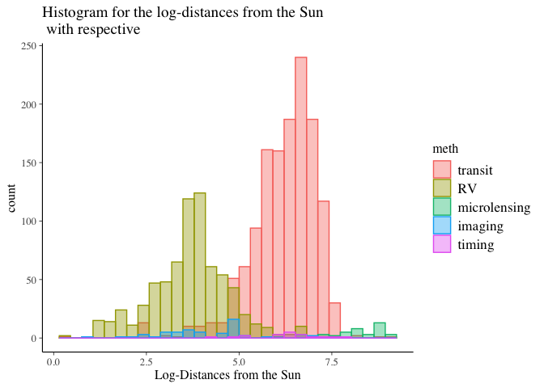<!-- -->

From the plot we can see that there are more number of exoplanets with
*transit* method of
discovery.

### Question 4 : Create scatterplots of the log-mass versus log-distances, separating by methods of discovery. Hovering with the cursor highlights the point and displays its name, and, if you click, the exoplanet’s page on the Open Exoplanet Catalogue will be opened. (paste the id after <http://www.openexoplanetcatalogue.com/planet/> ).

``` r
# Adding a new column called onclick which redirects users on the click of exoplanet point in scatter plots should directed to respective exoplanet plage on the Open Exoplanet Catalogue.

#onclick is a concatinated string of "http://www.openexoplanetcatalogue.com/planet/" with exoplanet id.
#Example : "http://www.openexoplanetcatalogue.com/planet/K2-34 b" link will be opened on click of "K2-34 b" exoplanet 
data$onclick = sprintf("window.open(\"%s%s\")",
                           "http://www.openexoplanetcatalogue.com/planet/",
                           as.character(data$id))

#Plotting log of mass against log distance with highlighting the mehtod of discovery. geom_point_interactive and ggiraph helps to add intractivity to ggplot and on hovering on any expolanet  display the expolanet name and onclick redirects to respective exoplanet's page on the Open Exoplanet Catalogue 

  p = ggplot(data,
             aes(x = log(data$mass),
                 y = log(data$dist),colour = meth))+ ggtitle("Scatter plot of Log-mass vs Log-distance") + xlab("Log-mass") + ylab("Log-distance")+ geom_point_interactive(aes(tooltip = (data$id),
                                                                                  data_id = (data$id),
                                                                                  onclick = onclick))   
  ggiraph(code = print(p),width = 1)
```

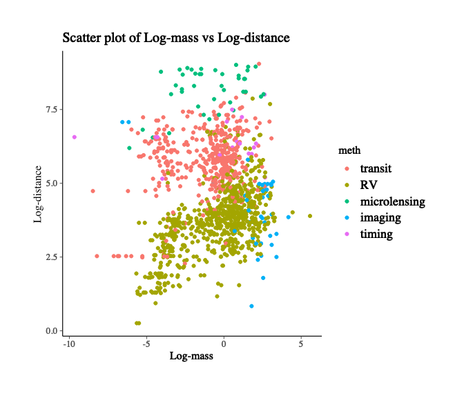<!-- -->

From the scatter plot we can see there are clear clusters of exoplanets
with method of discovery *transit*,*RV*,*microlensing* except for
exoplanets with *imaging*,*timing* methods of discovery which doesn’t
show clear cluster
structure.

### Question 5 : Rename the radius into jupiter\_radius, and create a new column called earth\_radius which is 11.2 times the Jupiter radius.

``` r
# Here initially we are renaming the radius to jupiter_radius with rename function and the adding a new column earth_radius which is 11.2 times jupiter_radius with mutate function 
data <- data %>% rename(jupiter_radius = radius) %>% mutate(earth_radius = jupiter_radius * 11.2)

#Display the first few rows of earth_radius 
head(data$earth_radius)
```

    ## [1] 0.6048 1.5680 0.7952 9.4080 9.1840 1.6464

### Question 6 : Focus only on the rows where log-radius and log-period have no missing values, and perform kmeans with four clusters on these two columns.

``` r
#Using filter function we consider only data without NA's with respect to column log-earth_radius and log-period
data <- data %>% filter(log(earth_radius) != 'NA' & log(period) != "NA")

#K-means can take only input of the form numeric matrix of data, or an object that can be coerced to such a matrix, hence we are consider only matrix of 2 columns.
X <- matrix(c(log(data$earth_radius),log(data$period)), nrow = length(data$earth_radius),ncol = 2, byrow = FALSE)

#Appling the K-means with 4 centers/Clusters
fitkm <- kmeans(X,centers = 4,nstart = 1)

#Displaying the with in sum of squared errors of each cluster fitted
fitkm$withinss
```

    ## [1] 145.9674 447.9820 614.8231 495.2603

We can see that *Cluster 3* has observations which are close/compact
compared to *Cluster
1,2,4*

### Question 7 : Add the clustering labels to the dataset through a new factor column called ‘type’, with levels ‘rocky’, ‘hot\_jupiters’, ‘cold\_gas\_giants’, ‘others’; similarly to <https://en.wikipedia.org/wiki/Exoplanet#/media/File:ExoplanetPopulations-20170616.png>

``` r
#Adding a new column which consists of fitted clusters which were fitted previously. 
data  <- data %>% mutate(type = fitkm$cluster)

#Making the column data of factor type
data$type <- as.factor(data$type)

#values in column can consist of only 4 values, so adding levels and assigning the respective names.
#Here names are assigned looking at the cluster size in the given wikipedia link. 
levels(data$type) <- list("cold_gas_giants"="1", "others"="3", "hot_jupiters"="4",
                          "rocky"="2")
#Displaying the number of observations with respective cluster name
table(data$type)
```

    ## 
    ## cold_gas_giants          others    hot_jupiters           rocky 
    ##             385             416             798            1133

### Question 8 : Use a histogram and a violin plot to illustrate how these clusters relate to the log-mass of the exoplanet.

``` r
#Fitting a histogram of log-mass data and highlighting based on cluster type
ggplot(data,aes(x = log(mass)))+geom_histogram(aes(color = type,fill = type),position = "identity",bins = 30,alpha = 0.4)+labs(title = "Histogram of log-mass distribution") + xlab("Log of mass")
```

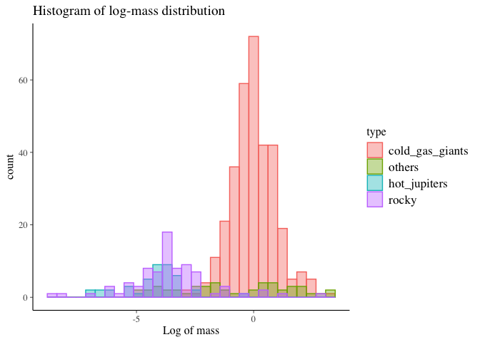<!-- -->

``` r
#Fitting a violin plot of log-mass data and highlighting based on cluster type
ggplot(data,aes(y = log(mass),x = type, fill = type))+ geom_violin(alpha=0.25, position = position_dodge(width = .75),size=1,color="black") +labs(title = "Violin plot of log-mass distribution with mean and median")+ xlab("Cluster Type")+ylab("Log of Mass") + stat_summary(fun.y=mean, geom="point", shape=23, size=2) + stat_summary(fun.y=median, geom="point", shape=23, size=2)
```

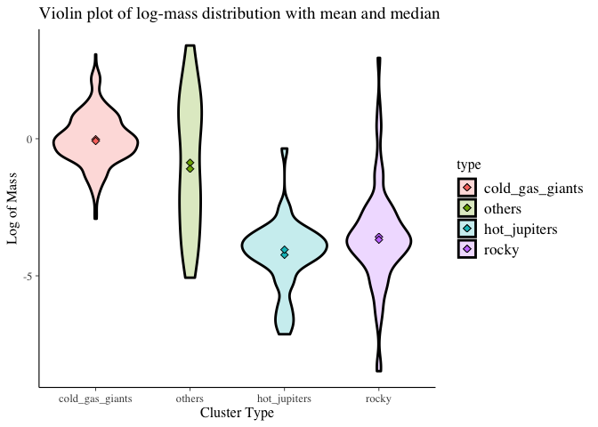<!-- -->

  - From above histogram we can see that distribution of log-mass is not
    normally distributed for most of the cluster type and exoplanets in
    *others* cluster type have more log mass than other cluster types.
    It would be easy to explain using violin plot
  - From Violin plot we can clearly see that log-mass distribution of
    few of the cluster is normally distributed
  - Violin plot of *cold\_gas\_gaints* shows that its almost standard
    normally distributed with mean and median equal to zero with
    slightly higher variance than standard normal distribution and not
    skewed i.e, symmetrically distributed
  - Violin plot of *others* shows that its not standard normally
    distributed with mean and median silightly different and not equal
    to zero and distribution is right skewed i.e, not symmetrically
    distributed
  - Violin plot of *hot\_jupiter* shows that its not standard normally
    distributed with mean and median silightly different and not equal
    to zero and distribution is slightly right skewed i.e, not
    symmetrically distributed
  - Violin plot of *rocky* shows that its also not standard normally
    distributed with mean and median silightly different and not equal
    to zero and distribution is left skewed i.e, not symmetrically
    distributed
  - From Violin plots we can see that *others*,*hot\_jupiters*,*rocky*
    need to be
transformed.

### Question 9 : transform r\_asc and decl into the equivalent values in seconds and use these as coordinates to represent a celestial map for the exoplanets.

``` r
# Below function breaks the string input and returns the corresponding output in seconds
convert <- function(x)
{
  #Spliting the string based on space and .
  splitString <- as.numeric(unlist(strsplit(x, "\\s|\\.")))
  
  # if there is no millisecond then we are adding 0 to above list which help us while calculating the seconds
  if(is.na(splitString[4]))
  {
    splitString[4] = 0
  }
  #Returning the respective seconds.
  return(splitString[1]*3600+splitString[2]*60+splitString[3]+(splitString[4]/100))
}

# loading the data 
data1 <- data_original %>% filter(!is.na(meth))

#For each row we are tranforming the r_asc and decl column values into seconds.
for(i in 1:nrow(data1))
{
  data1[i,18] <- as.numeric(convert(as.character(data1[i,18])))
  data1[i,17] <- as.numeric(convert(as.character(data1[i,17])))
}

#Plotting these as coordinates (i.e, r_asc and decl column values) to represent a celestial map for the exoplanets.
ggplot(data1,
           aes(x = as.numeric(data1$r_asc),
               y = as.numeric(data1$decl)))  + geom_point(aes(color = meth)) + xlab("Right ascension") + ylab("Declination") + ggtitle("Celestial map for the exoplanets with Right Ascension and Declination")
```

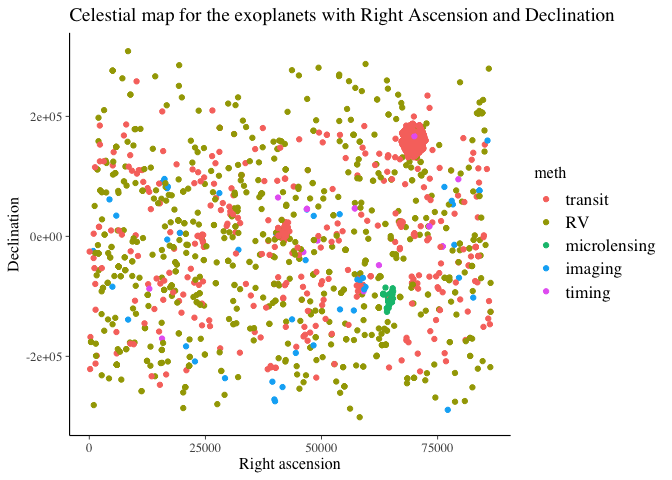<!-- -->

From the above scatter plot we can see that there are some exoplanets
which have close *Declination and Right ascension* which have same
method of discovery. And we can see that there is no relationship
between *Declination and Right
ascension*

### Question 10 : create an animated time series where multiple lines illustrate the evolution over time of the total number of exoplanets discovered for each method up to that year.

``` r
#Loading the original data
data2 <- data_original %>% filter(!is.na(year) & !is.na(meth))

#Grouping by years and method of discovery and finding the counts
data2 <- data2 %>% group_by(meth,year) %>%summarise(count = n())     

#Calcuating the cummulative sum as question is upto to that year
data2$cumsum <- ave(data2$count, data2$meth, FUN=cumsum) 

p <- ggplot(
  data2,
  aes(year, cumsum, color = meth)) +
  geom_line() +
  scale_color_viridis_d() +
  labs(x = "Year", y = "Number of exoplanets discovered")  + ggtitle("Evolution over time of the total number of exoplanets discovered \n for each method up to that year")
p + geom_point(aes(group = seq_along(year))) + transition_reveal(year) #adding the animation 
```

``` 
## 
Rendering [---------------------------------------] at 3.2 fps ~ eta: 31s
Rendering [>--------------------------------------] at 2.8 fps ~ eta: 35s
Rendering [>--------------------------------------] at 2.8 fps ~ eta: 34s
Rendering [=>-------------------------------------] at 2.9 fps ~ eta: 33s
Rendering [=>---------------------------------------] at 3 fps ~ eta: 31s
Rendering [=>-------------------------------------] at 3.1 fps ~ eta: 30s
Rendering [==>------------------------------------] at 3.1 fps ~ eta: 30s
Rendering [==>------------------------------------] at 3.2 fps ~ eta: 29s
Rendering [===>-----------------------------------] at 3.2 fps ~ eta: 29s
Rendering [===>-----------------------------------] at 3.2 fps ~ eta: 28s
Rendering [====>----------------------------------] at 3.2 fps ~ eta: 27s
Rendering [====>----------------------------------] at 3.3 fps ~ eta: 26s
Rendering [=====>---------------------------------] at 3.3 fps ~ eta: 26s
Rendering [======>--------------------------------] at 3.3 fps ~ eta: 25s
Rendering [======>--------------------------------] at 3.2 fps ~ eta: 25s
Rendering [=======>-------------------------------] at 3.2 fps ~ eta: 25s
Rendering [=======>-------------------------------] at 3.2 fps ~ eta: 24s
Rendering [========>------------------------------] at 3.2 fps ~ eta: 24s
Rendering [========>------------------------------] at 3.3 fps ~ eta: 23s
Rendering [=========>-----------------------------] at 3.2 fps ~ eta: 23s
Rendering [=========>-----------------------------] at 3.3 fps ~ eta: 23s
Rendering [==========>----------------------------] at 3.3 fps ~ eta: 22s
Rendering [===========>---------------------------] at 3.3 fps ~ eta: 21s
Rendering [============>--------------------------] at 3.3 fps ~ eta: 21s
Rendering [============>--------------------------] at 3.3 fps ~ eta: 20s
Rendering [=============>-------------------------] at 3.3 fps ~ eta: 20s
Rendering [=============>-------------------------] at 3.3 fps ~ eta: 19s
Rendering [==============>------------------------] at 3.3 fps ~ eta: 19s
Rendering [===============>-----------------------] at 3.3 fps ~ eta: 18s
Rendering [================>----------------------] at 3.3 fps ~ eta: 17s
Rendering [=================>---------------------] at 3.3 fps ~ eta: 17s
Rendering [=================>---------------------] at 3.3 fps ~ eta: 16s
Rendering [==================>--------------------] at 3.3 fps ~ eta: 16s
Rendering [===================>-------------------] at 3.3 fps ~ eta: 15s
Rendering [====================>------------------] at 3.3 fps ~ eta: 14s
Rendering [=====================>-----------------] at 3.3 fps ~ eta: 13s
Rendering [======================>----------------] at 3.3 fps ~ eta: 13s
Rendering [======================>----------------] at 3.3 fps ~ eta: 12s
Rendering [=======================>---------------] at 3.3 fps ~ eta: 12s
Rendering [========================>--------------] at 3.3 fps ~ eta: 11s
Rendering [=========================>-------------] at 3.3 fps ~ eta: 10s
Rendering [==========================>------------] at 3.3 fps ~ eta: 10s
Rendering [==========================>------------] at 3.3 fps ~ eta:  9s
Rendering [===========================>-----------] at 3.3 fps ~ eta:  9s
Rendering [===========================>-----------] at 3.3 fps ~ eta:  8s
Rendering [============================>----------] at 3.3 fps ~ eta:  8s
Rendering [=============================>---------] at 3.3 fps ~ eta:  7s
Rendering [==============================>--------] at 3.3 fps ~ eta:  6s
Rendering [===============================>-------] at 3.3 fps ~ eta:  6s
Rendering [===============================>-------] at 3.3 fps ~ eta:  5s
Rendering [================================>------] at 3.3 fps ~ eta:  5s
Rendering [=================================>-----] at 3.3 fps ~ eta:  4s
Rendering [=================================>-----] at 3.2 fps ~ eta:  4s
Rendering [==================================>----] at 3.2 fps ~ eta:  3s
Rendering [===================================>---] at 3.2 fps ~ eta:  2s
Rendering [====================================>--] at 3.2 fps ~ eta:  2s
Rendering [====================================>--] at 3.2 fps ~ eta:  1s
Rendering [=====================================>-] at 3.2 fps ~ eta:  1s
Rendering [======================================>] at 3.2 fps ~ eta:  0s
Rendering [=======================================] at 3.2 fps ~ eta:  0s
                                                                         
```

    ## 
    Frame 1 (1%)
    Frame 2 (2%)
    Frame 3 (3%)
    Frame 4 (4%)
    Frame 5 (5%)
    Frame 6 (6%)
    Frame 7 (7%)
    Frame 8 (8%)
    Frame 9 (9%)
    Frame 10 (10%)
    Frame 11 (11%)
    Frame 12 (12%)
    Frame 13 (13%)
    Frame 14 (14%)
    Frame 15 (15%)
    Frame 16 (16%)
    Frame 17 (17%)
    Frame 18 (18%)
    Frame 19 (19%)
    Frame 20 (20%)
    Frame 21 (21%)
    Frame 22 (22%)
    Frame 23 (23%)
    Frame 24 (24%)
    Frame 25 (25%)
    Frame 26 (26%)
    Frame 27 (27%)
    Frame 28 (28%)
    Frame 29 (29%)
    Frame 30 (30%)
    Frame 31 (31%)
    Frame 32 (32%)
    Frame 33 (33%)
    Frame 34 (34%)
    Frame 35 (35%)
    Frame 36 (36%)
    Frame 37 (37%)
    Frame 38 (38%)
    Frame 39 (39%)
    Frame 40 (40%)
    Frame 41 (41%)
    Frame 42 (42%)
    Frame 43 (43%)
    Frame 44 (44%)
    Frame 45 (45%)
    Frame 46 (46%)
    Frame 47 (47%)
    Frame 48 (48%)
    Frame 49 (49%)
    Frame 50 (50%)
    Frame 51 (51%)
    Frame 52 (52%)
    Frame 53 (53%)
    Frame 54 (54%)
    Frame 55 (55%)
    Frame 56 (56%)
    Frame 57 (57%)
    Frame 58 (58%)
    Frame 59 (59%)
    Frame 60 (60%)
    Frame 61 (61%)
    Frame 62 (62%)
    Frame 63 (63%)
    Frame 64 (64%)
    Frame 65 (65%)
    Frame 66 (66%)
    Frame 67 (67%)
    Frame 68 (68%)
    Frame 69 (69%)
    Frame 70 (70%)
    Frame 71 (71%)
    Frame 72 (72%)
    Frame 73 (73%)
    Frame 74 (74%)
    Frame 75 (75%)
    Frame 76 (76%)
    Frame 77 (77%)
    Frame 78 (78%)
    Frame 79 (79%)
    Frame 80 (80%)
    Frame 81 (81%)
    Frame 82 (82%)
    Frame 83 (83%)
    Frame 84 (84%)
    Frame 85 (85%)
    Frame 86 (86%)
    Frame 87 (87%)
    Frame 88 (88%)
    Frame 89 (89%)
    Frame 90 (90%)
    Frame 91 (91%)
    Frame 92 (92%)
    Frame 93 (93%)
    Frame 94 (94%)
    Frame 95 (95%)
    Frame 96 (96%)
    Frame 97 (97%)
    Frame 98 (98%)
    Frame 99 (99%)
    Frame 100 (100%)
    ## Finalizing encoding... done!

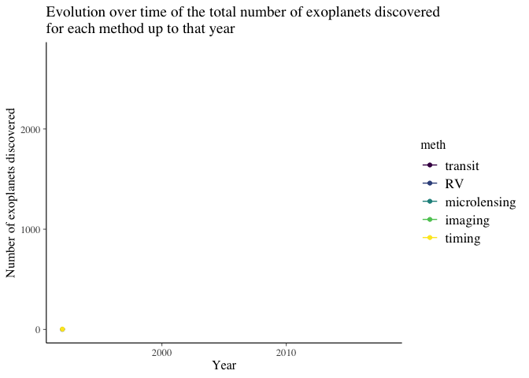<!-- -->

From the plot we can see that there were more number of exoplanets
discovered with transit method of discovery after 2010 followed by RV
method of discovery which had initially highest number of exoplanets
discovered unitl 2010. All other method of discovery had low number of
exoplanets discovered over
time.

### Question 11 : create an interactive plot with Shiny where you can select the year (slider widget, with values \>= 2009) and exoplanet type. Exoplanets appear as points on a scatterplot (log-mass vs log-distance coloured by method) only if they have already been discovered. If type is equal to “all” all types are plotted together.

``` r
#building the UI
ui <- fluidPage(
  
  titlePanel("Exoplanet Catalogue Data"),
  
    sidebarLayout( #Layout
    sidebarPanel(
      # Sider for year selection
    sliderInput(inputId = "year",
                label = "Select a Year",
                value = 2010, min = 2009, max = 2018), #Given minimum year is 2009 and max year in the data is 2018
    
    # Select type of clusters(Fitting only respective exoplanet type only if they have already been discovered) or All(Fitting all the exoplanet type  only if they have already been discovered) 
    selectInput(inputId = "type", label = strong("Exoplanet Type"),
                choices = c("rocky","cold_gas_giants","hot_jupiters","others","All"), #Adding various exoplanet types
                selected = "rocky")
    ),
    
    # Show generated plot   
    mainPanel(
        plotOutput("Plot")
    )
    )
)

# Define server logic required to draw a histogram
server <- function(input, output) {

    # Subset data 
    selected_trends <- reactive({
      # If particular exoplanet type is selected then display only respective Exoplanets as points which have already been discovered
        if(input$type != "All"){
            data %>% filter(year <= input$year & type == input$type)
        }
      # If All is selected the display all the exoplanets as points which have already been discovered
        else
        {
           data %>% filter(year <= input$year)
        }
    })
    
    # Returning the respective output to ui section which will be displayed
    output$Plot <- renderPlot({
      # The scatter plot of log-mass vs log-dist colored with respective method of respective exoplanets as points which have already been discovered
        ggplot(selected_trends(),
               aes(x = log(selected_trends()$mass),
                   y = log(selected_trends()$dist),colour = selected_trends()$meth)) + geom_point() + xlab("Log-Mass") + ylab("Log-Distance") + ggtitle("Scatter plot of log-mass vs log-distance of exoplanets only if discovered") + scale_color_discrete(name = "Method of discovery")
    })
}
```

### Question 12: Use STAN to perform likelihood maximisation on a regression model where log-period is the response variable and the logs of host\_mass, host\_temp and axis are the covariates (exclude rows that contain at least one missing value). Include an intercept term in the regression model.

``` r
# Stan Script
stan_model1 <- "
data {
  // Define all the data here
  int<lower=0> N; // number of observations
  int<lower=0> K; // number of explanatory variables
  matrix[N, K] x; // explanatory variables
  vector[N] y; // response variable
}
parameters {
  // Define parameters here
  real alpha; // intercept
  vector[K] beta; // slope
  real<lower=0> sigma; // residual sd
}
transformed parameters {
  vector[N] fits;
  fits = alpha + (x*beta);
}
model {
  // In this version X is a matrix
  y ~ normal(fits, sigma);
}
generated quantities {
  vector[N] res;
  //Calculating the difference between fitted and actual values
  res = y - fits;
}
"
# to save time when you recompile an already compiled file:
rstan_options(auto_write = TRUE)

# Always good to enable parallel running if available:
options(mc.cores = parallel::detectCores())

#Selecting only explanatory variables and response variables from the data
data_stan <- data_original %>% select(host_mass,host_temp,axis,period)

#Excluding the missing values data
data_stan <- na.omit(data_stan)

#Creating a list of parameters that need to be passed to stan_model1 
stan_data_reg = list(N = nrow(data_stan), #Number of rows
                         x = cbind(log(data_stan$host_mass), log(data_stan$host_temp), log(data_stan$axis)),#log-Explanatory variables
                         K = 3, #Number of Explanatory variables
                         y = log(data_stan$period)) #log of response variable

#A stanmodel object can then be used to draw samples from the model.
stan_model_bin_reg_1 = stan_model(model_code = stan_model1)

# Optimizing the parameters and returing the parameter values once converged 
stan_run_bin_reg_1 = optimizing(stan_model_bin_reg_1, data = stan_data_reg)

#Intercept value
print(stan_run_bin_reg_1$par[1])
```

    ##    alpha 
    ## 5.657512

``` r
#residual sd
print(stan_run_bin_reg_1$par[5])
```

    ##     sigma 
    ## 0.2136854

``` r
#Slope for log-host_mass
print(stan_run_bin_reg_1$par[2])
```

    ##    beta[1] 
    ## -0.4124754

``` r
#Slope for log-host_temp
print(stan_run_bin_reg_1$par[3])
```

    ##    beta[2] 
    ## 0.02608145

``` r
#Slope for log-axis
print(stan_run_bin_reg_1$par[4])
```

    ##  beta[3] 
    ## 1.488071

``` r
#Maximum likelihood value
print(stan_run_bin_reg_1$value)
```

    ## [1] 1364.604

``` r
#Checking if converged. If value = 0 then converged else not converged
print(stan_run_bin_reg_1$return_code)
```

    ## [1] 0

From the above output we can see that is alpha is largest value compared
to other parameters and log host\_mass has negative slope implies
lowered the response value as explanatory increased and as log-axis or
log host\_temp increased response(period) variable increased
respectively.

### Question 13 : Extend the model in (12) by specifying standard Gaussian priors for the intercept and slope terms, and a Gamma(1,1) prior for the standard deviation of errors. Obtain approximate samples from the posterior distribution of the model.

``` r
#Stan Script (Extension of above stan_model1)
stan_model2 <- "

data {
  // Define all the data here
  int<lower=0> N; // number of observations
  int<lower=0> K; // number of explanatory variables
  matrix[N, K] x; // explanatory variables
  vector[N] y; // response variable
}
parameters {
  // Define parameters here
  real alpha; // intercept
  vector[K] beta; // slope
  real<lower=0> sigma; // residual sd
}

model {
  // In this version X is a matrix
  
  //specifying standard Gaussian priors to slopes
  to_vector(beta) ~ normal(0, 1);

  //specifying standard Gaussian priors to intercept
  alpha ~  normal(0, 1);
  
  //specifying Gamma prior(1,1) to standard deviation of errors
  sigma ~ gamma(1,1);
  y ~ normal(alpha + (x*beta), sigma);
}


"

stan_model_bin_reg_1 = stan_model(model_code = stan_model2)
```

    ## recompiling to avoid crashing R session

``` r
#Draw samples from the model defined by class stanmodel.
stan_run_bin_reg_1 = sampling(stan_model_bin_reg_1, data = stan_data_reg)
```

``` r
# Printing the output obtained from above sampling
print(stan_run_bin_reg_1)
```

    ## Inference for Stan model: d490ea00afc0b4ea0a385e9e1df08c63.
    ## 4 chains, each with iter=2000; warmup=1000; thin=1; 
    ## post-warmup draws per chain=1000, total post-warmup draws=4000.
    ## 
    ##            mean se_mean   sd    2.5%     25%     50%     75%   97.5% n_eff
    ## alpha      5.23    0.01 0.28    4.67    5.04    5.23    5.41    5.75  1189
    ## beta[1]   -0.43    0.00 0.02   -0.46   -0.44   -0.43   -0.42   -0.39  1629
    ## beta[2]    0.08    0.00 0.03    0.02    0.05    0.08    0.10    0.14  1186
    ## beta[3]    1.49    0.00 0.00    1.48    1.49    1.49    1.49    1.50  2968
    ## sigma      0.21    0.00 0.00    0.21    0.21    0.21    0.22    0.22  2231
    ## lp__    1344.35    0.04 1.59 1340.39 1343.53 1344.71 1345.52 1346.45  1531
    ##         Rhat
    ## alpha   1.01
    ## beta[1] 1.00
    ## beta[2] 1.01
    ## beta[3] 1.00
    ## sigma   1.00
    ## lp__    1.00
    ## 
    ## Samples were drawn using NUTS(diag_e) at Wed Sep  4 00:37:16 2019.
    ## For each parameter, n_eff is a crude measure of effective sample size,
    ## and Rhat is the potential scale reduction factor on split chains (at 
    ## convergence, Rhat=1).

  - From the output we can see that means(point estimation) for
    *intercept*, *beta 1*,*beta 2*, *sigma* and *beta 3* parameters have
    almost close to what we have obtained in
optimization.

### Question 14 : Include in your RMarkdown document a few posterior summaries plots (e.g. estimated posterior densities) from (13) for the parameters of interest.

``` r
# Extracting the bayesian or sampling model output
posterior <- as.array(stan_run_bin_reg_1)

color_scheme_set("red")
#Plotting uncertanity in each  parameters estimation
mcmc_intervals(posterior, pars = c("alpha", "beta[1]","beta[2]","beta[3]","sigma"))
```

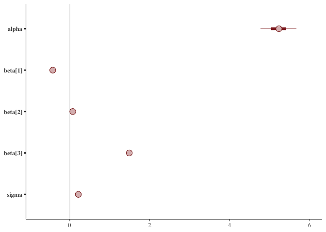<!-- -->

From the above plot we can see that there is less or no uncertanity in
parameters such slopes and sigma but there is some uncertanity in
intercept

``` r
color_scheme_set("green")

#Histogram of  final parameter estimation
mcmc_hist(posterior, pars = c("alpha", "beta[1]","beta[2]","beta[3]","sigma"))
```

    ## `stat_bin()` using `bins = 30`. Pick better value with `binwidth`.

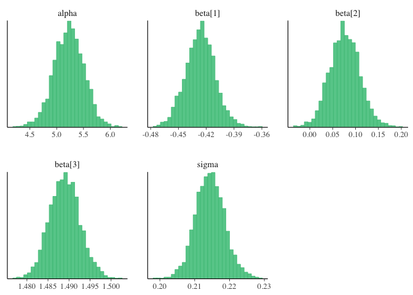<!-- -->

From the above histogram plot we see that all the posterior density of
parameters are normally distributed.

``` r
color_scheme_set("brightblue")

#Histogram of  parameter estimation for each chain
mcmc_hist_by_chain(posterior, pars = c("alpha", "beta[1]","beta[2]","beta[3]","sigma"))
```

    ## `stat_bin()` using `bins = 30`. Pick better value with `binwidth`.

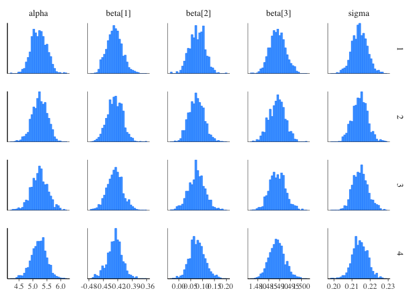<!-- -->

``` r
color_scheme_set("purple")
# Posterior Density plot of each paramters 
mcmc_dens(posterior, pars = c("alpha", "beta[1]","beta[2]","beta[3]","sigma"))
```

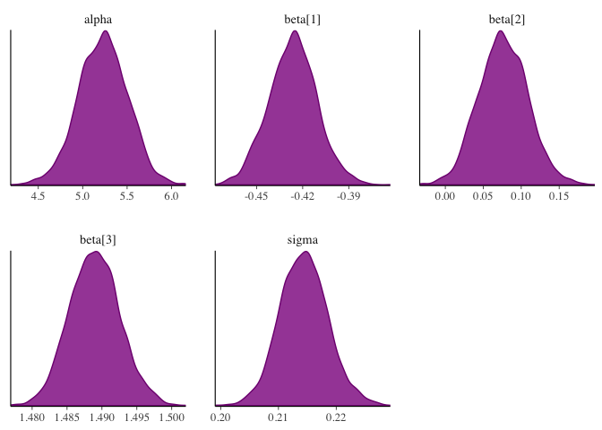<!-- -->

``` r
color_scheme_set("mix-blue-red")
#Trace plot of each  parmeter estimation on different chains
mcmc_trace(posterior, pars = c("alpha", "beta[1]","beta[2]","beta[3]","sigma"), 
           facet_args = list(ncol = 1, strip.position = "left"))
```

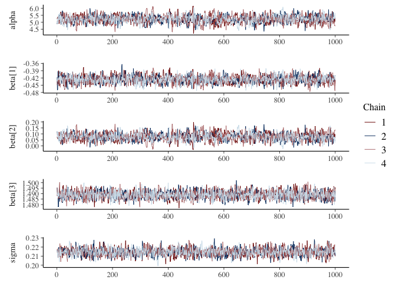<!-- --> From the
above traceplot look like convergence is fine for all parameters.

``` r
color_scheme_set("gray")


# Scatter plot to show the relationship between beta 1 and beta 3 parameters
mcmc_scatter(posterior, pars = c("beta[1]", "beta[3]"), 
             size = 1.5, alpha = 0.5) 
```

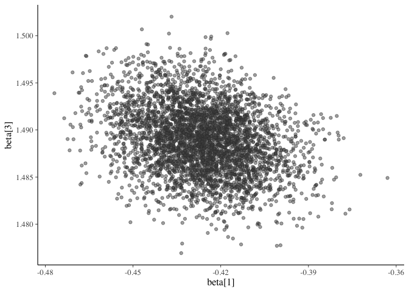<!-- -->

``` r
#Pairs plot showing the relationship between each of the  estimated parameters
color_scheme_set("pink")
mcmc_pairs(posterior, pars = c("alpha", "beta[1]","beta[2]","beta[3]","sigma"),
           off_diag_args = list(size = 4))
```

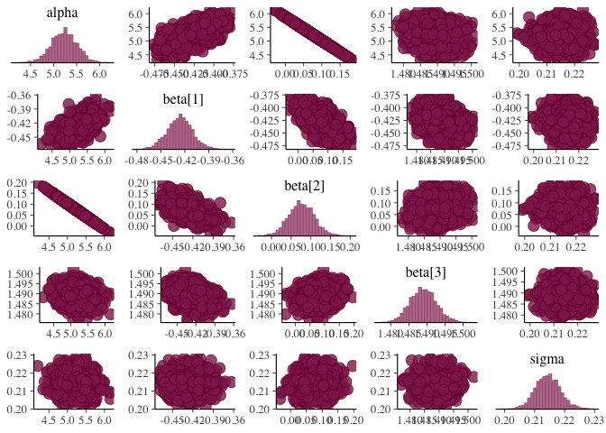<!-- -->

``` r
#Posterior density plots of each of the parameters with 95% intervals and median values

plot_title <- ggtitle("Posterior distributions",
                      "with medians and 95% intervals")
mcmc_areas(posterior,
           pars = c("alpha"),prob = 0.95
           ) + ggplot2::labs(
             title = "Posterior distributions of intercept",
             subtitle = "with medians and 95% intervals"
           )
```

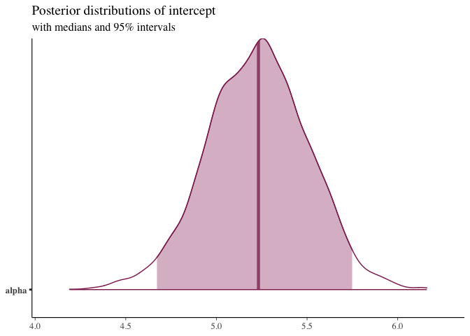<!-- -->

``` r
mcmc_areas(posterior,
           pars = c("beta[1]"),prob = 0.95
) + ggplot2::labs(
  title = "Posterior distributions of slope of log-host_mass",
  subtitle = "with medians and 95% intervals"
)
```

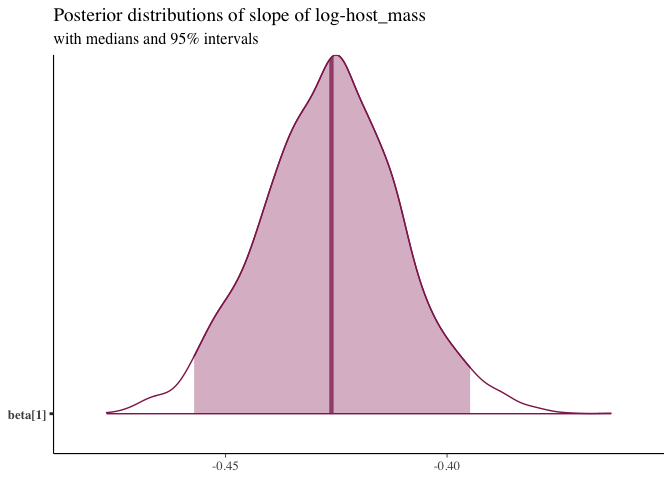<!-- -->

``` r
mcmc_areas(posterior,
           pars = c("beta[2]"),prob = 0.95
) + ggplot2::labs(
  title = "Posterior distributions of slope of log-host_temp",
  subtitle = "with medians and 95% intervals"
)
```

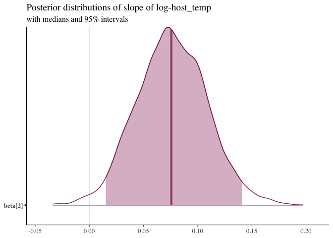<!-- -->

``` r
mcmc_areas(posterior,
           pars = c("beta[3]"),prob = 0.95
) + ggplot2::labs(
  title = "Posterior distributions of slope of log-axis",
  subtitle = "with medians and 95% intervals"
)
```

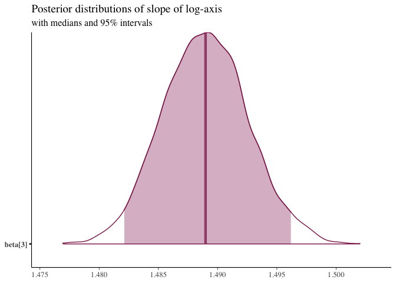<!-- -->

``` r
mcmc_areas(posterior,
           pars = c("sigma"),prob = 0.95) + ggplot2::labs(
  title = "Posterior distributions of residual standard deviation",
  subtitle = "with medians and 95% intervals"
)
```

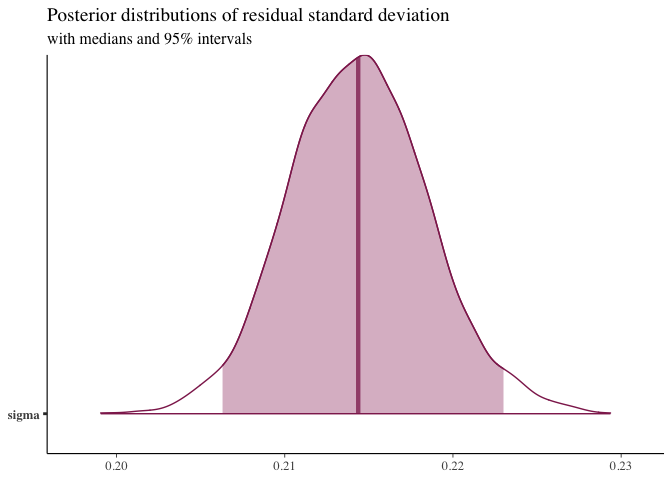<!-- -->

### Question 15 : Embed the Shiny app from (11) in your RMarkdown document.

``` r
# Uncommeny this code to run the above Shiny application  
#shinyApp(ui = ui, server = server)

#Hosted Shiny solution is available in the below link.
```

<https://macprash.shinyapps.io/shinycode/>
